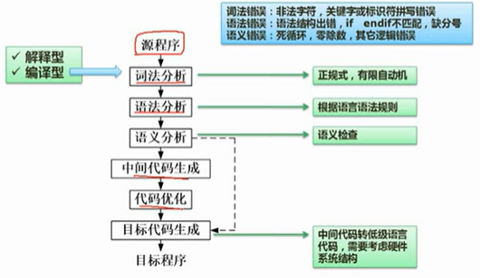
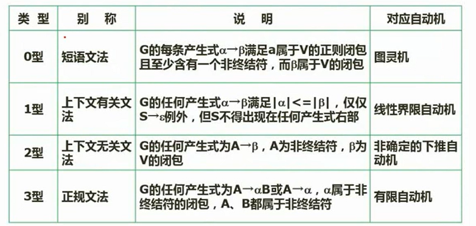
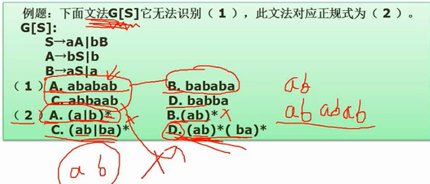
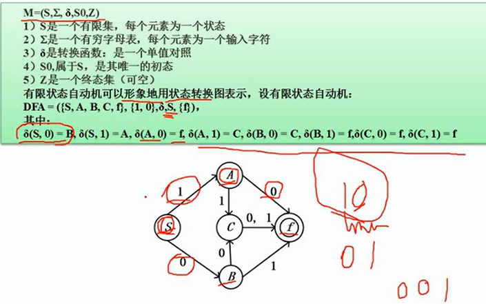
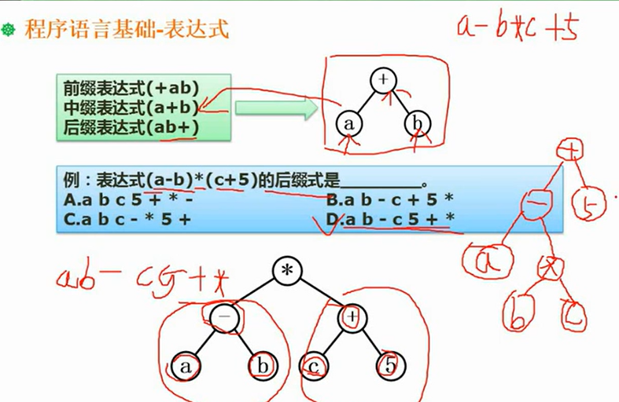

## 编译与解释

有些语义错误是无法通过机器检查发现的
高级语言代码不一定要转化为机器代码 可以转化为中间代码 依靠虚拟机支撑(java,py)。

**记号流，词法分析的输出是记号流，也就是语法分析的输入**。
源程序，词法分析的任务是把源程序的字符串转换成**单词符号序列**。
分析树，如果没有语法错误，语法分析后就能正确的构造出其语法树。             

对于解释器而言，可以直接解释源程序，**无需经历中间代码生成和代码优化过程**。
分配寄存器是在目标代码生成阶段。

**符号表**的作用是记录源程序中各个符号的必要信息，以辅助语义的正确性检查和代码生成，在编译过程中需要对符号表进行快速有效地査找、插入、修改和删除等操作；**符号表的建立可以始于词法分析**阶段，也可以**放到语法分析和语义分析**阶段，但符号表的使用有时会延续到目标代码的运行阶段。（**反正编译离不开符号表**）

**有限自动机**是进行**词法分析**的工具。

编译和解释是翻译高级语言的两种方式（编译器有解释型和编译型），解释是转化为中间表达形式在执行，编译则是翻译成目标语言程序；**编译**使得机器运行目标代码不需要源程序和目标程序，**目标程序独立**；但**解释**方式下，源程序和解释程序要参与到程序的运行当中，**目标程序不独立**。

编译是将高级语言源程序翻译成机器语言程序（汇编形式或机器代码形式），**反编译是编译的逆过程**。**反编译通常不能把可执行文件还原成高级语言源代码，只能转换成功能上等价的汇编程序。**   

**编译**过程中为变量**分配**存储单元所用的地址是**逻辑地址**，程序**运行**时再**映射为物理地址**。

程序已经开始**运行**，说明**编译时无错误**，因此**不是语法错误和词法错误**，**编译时发现的语义错误称为静态的语义错误**。运行时陷入死循环属于**动态语义错误**。   

**语法分析方法分为两类**：**自上而下**（自顶向下）分析法和**自下而上**（自底向上）分析法，**递归下降分析法和预测分析法属于自上而下**分析法，**移进-归约分析法属于自下而上**（自底向上）分析法。                                    

在编写C/C++源程序时，为变量赋初值不是强制的要求，因此**编译程序不检查变量是否赋初值**。如果表达式中引用的变量从定义到使用**始终没有赋值**，则该变量中的值表现为**一个随机数**，这样对表达式的**求值结果就是不确定**的了。

对于除数为0，编译不会报错，而运行时才会报错。

中间代码常见的表达形式是逆波兰记号、四元式、三元式和树。

## 文法(了解)

四元组（V,T,S,P) 非终结符 终结符 起始符 产生式

类别

大多数程序设计语言的语法规则用**上下文无关文法**描述即可。

语法推导树

终结符是不能进行推导的

## 正规式（每次考

| 表示 或 

*表示 若干个 **0到n个**

格式：（XX若干个字符或字符组合，可能出现|）以及*

文法推导

S无法推导到babba 选D
第二题要选等价的 但是A选项明显连第一题的D选项都可以表达 所以不是等价 选C

## 有限自动机

没有扇入或奇迹扇入一般就是初态，同心圆或加粗边圆一般就是终态。

**非确定**有限状态自动机与**确定**有限状态自动机的**最大区别**是它们的**转移函数不同**。**确定**有限状态自动机对**每一个可能的输入只有一个状态的转移**。**非确定**有限状态自动机对**每一个可能的输入**可以**有多个状态转移**，接受到输入时从这多个状态转移中非确定地选择一个。       

​     

O(S,0)=B 表示 在S输入0到达B
一般是考察能不能解析出01,001序列 要借助状态转换图来查找对应路径是否存在

例题

注意：最后要到达C 选C

## 表达式（偶尔

先构造成树 再选择前序中序后序遍历
中缀表达式最大特点就是有括号。

注意，相同优先级就要从左到右运算！！！在构造树的过程中别忘了。

表达式采用逆波兰式时，使用栈计算。

## 传值与传址（经常

传值可以传变量，常量，表达式，但传递方向是单向的。
传址实参必须是变量，不能是表达式或常量，数据的传递方向是双向的。

## 多种程序语言特点（掌握特点

lisp函数式编程语言

