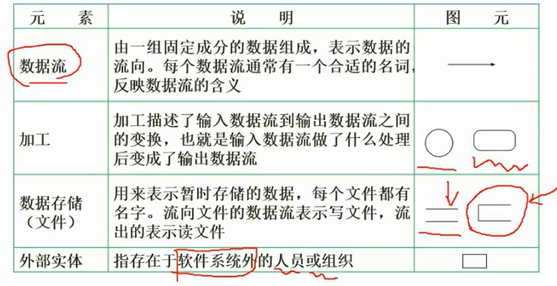
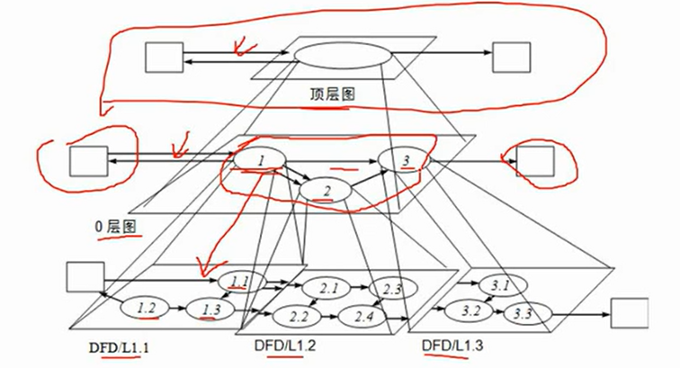
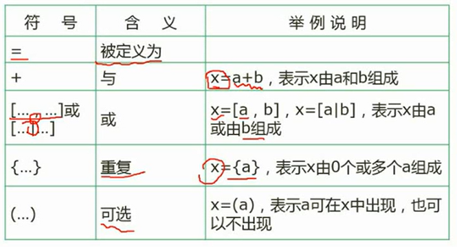
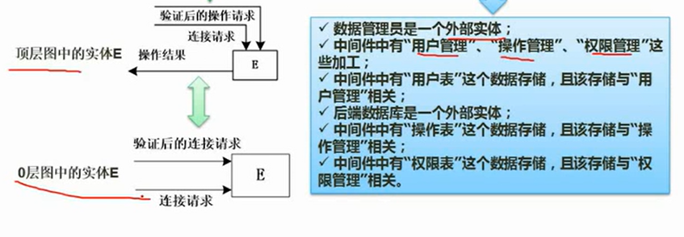

15分 下午题的第一道题

## 基本概念

顶层数据流图描述了系统的输入和输出。

**加工规格说明有三种描述方式：结构化语言、判断表（决策表）、判断树（决策树）**。
基本加工逻辑描述的基本原则为：1.对数据流图的**每一个加工**，必须**有一个说明**。2.基本加工逻辑说明必须**描述**基本加工如何把输入数据流变换为输出数据流的**加工规则**。3.加工逻辑说明必须**描述**实现**加工的策略而不是**实现加工的**细节**。4.加工逻辑说明中包含的信息应是充足的，完备的，有用的，无冗余的。             

## 数据字典

数据字典是配合数据流图而存在 对于简单的数据流 在数据字典里加以解释说明

 数据字典是指对数据的数据项、数据结构、数据流、数据存储、处理逻辑、外部实体等进行定义和描述，其目的是对数据流程图中的各个元素做出详细的说明，使用数据字典为简单的建模项目。其**条目有数据流、数据项、数据存储、基本加工**等。             

## 数据平衡原则

父图和子图之间的平衡：流出和流入的数据图要保持一致
子图内平衡：对于加工而言，至少保证要有一个数据流流入和一个数据流流出。

## 答题技巧

- 分析题干

  

- 利用数据平衡原则

  
